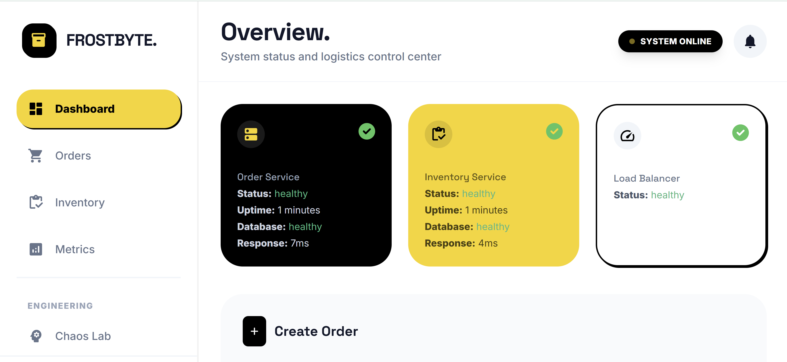

# Logarithm Warehouse

## 🏆 BUET 2026 Hackathon Winning Project — Microservices and DevOps

BUET CSE Fest 2026 - Microservices and DevOps Hackathon  
Team Logarithm

Live Deployment: [http://40.81.240.99/](http://40.81.240.99/)

## Dashboard Preview



## What This Project Solves

This project rebuilds a fragile e-commerce monolith into resilient microservices:

- Order Service for order lifecycle and orchestration
- Inventory Service for stock deduction and inventory state
- Separate PostgreSQL databases per service
- Nginx load balancer for traffic distribution
- Redis-backed deterministic latency simulation for chaos testing
- Monitoring with Prometheus and Grafana
- Azure VM deployment with automated CI/CD

## Core Fix: Deterministic Gremlin Delays Across Scaled Inventory Instances

### The Problem

With multiple Inventory replicas, per-instance local counters make "every 5th request is slow" non-deterministic globally.  
Example: if 3 replicas each keep their own counter, delays happen at different times per instance and the test scenario is inconsistent.

### The Solution Implemented

- Added Redis as a shared global counter source
- Inventory uses `INCR gremlin:global_counter` for every request
- Delay is applied when `globalCounter % GREMLIN_EVERY_NTH_REQUEST == 0`
- Delay behavior remains deterministic even with 3 scaled Inventory instances
- Local counter fallback is used only if Redis is unavailable

Implementation reference: `services/inventory-service/src/utils/gremlin.js`

## Architecture

```
Client
  |
  v
Nginx (port 80, least_conn)
  |-------------------------------|
  v                               v
Order Service                     Inventory Service (scaled: 3 replicas)
  |                               |
  v                               v
Order DB (PostgreSQL)             Inventory DB (PostgreSQL)
                                  |
                                  v
                               Redis (global Gremlin counter)

Monitoring: Prometheus + Grafana
```

## Reliability Patterns

- Timeout handling: Order Service does not wait forever for Inventory replies
- Retry handling: supports safe retries with idempotency keys
- Partial failure safety: handles commit-success but response-failure scenarios
- Chaos engineering with deterministic Gremlin latency
- Schrodinger crash simulation after commit (`CHAOS_CRASH_PROBABILITY`)

## Nginx Load Balancing

Nginx is configured with upstream blocks and `least_conn` to route requests across services.  
With scaling enabled, Inventory runs across multiple replicas while Order traffic stays stable through the load balancer.

Config reference: `infra/nginx/nginx.conf`

## Quick Start

### Prerequisites

- Docker
- Docker Compose v2+

### Run locally

```bash
docker compose up --build -d
```

### Scale Inventory to 3 replicas

```bash
docker compose up -d --scale inventory-service=3
```

### Health checks

```bash
curl http://localhost/health
curl http://localhost/order-health
curl http://localhost/inventory-health
```

## Key Runtime Configuration

From `docker-compose.yml`:

- `REDIS_URL=redis://redis:6379`
- `GREMLIN_ENABLED=true`
- `GREMLIN_EVERY_NTH_REQUEST=5`
- `GREMLIN_DELAY_MS=5000`
- `CHAOS_ENABLED=true`
- `CHAOS_CRASH_PROBABILITY=0.1`
- `REQUEST_TIMEOUT_MS=3000` (Order Service)

## Monitoring and Alerting

- Prometheus scrapes service metrics
- Grafana dashboards visualize latency, throughput, and chaos events
- Visual response-time alert is configured for Order Service latency threshold requirements

Access:

- Prometheus: `http://localhost:9090`
- Grafana: `http://localhost:3000`

## Azure VM and CI/CD

Production deployment is hosted at:

- [http://40.81.240.99/](http://40.81.240.99/)

Pipeline:

- CI workflow validates build and integration behavior
- CD workflow deploys to Azure VM using a self-hosted runner
- Post-deploy health checks and smoke tests are executed automatically

Workflow references:

- `.github/workflows/ci.yml`
- `.github/workflows/cd.yml`

## API Documentation

Full API reference is available at:

- [API_DOCUMENTATION.md](./API_DOCUMENTATION.md)

## Project Structure

```
logarithm-warehouse/
  services/
    order-service/
    inventory-service/
    frontend/
  infra/
    nginx/
    monitoring/
  scripts/
  docker-compose.yml
  API_DOCUMENTATION.md
  README.md
```

## Summary

This implementation directly addresses the distributed deterministic-delay problem by introducing a Redis global counter, so Gremlin behavior remains predictable under horizontal scaling (3 Inventory replicas), while Nginx load balancing, chaos simulation, observability, and Azure CI/CD make the system production-ready.
